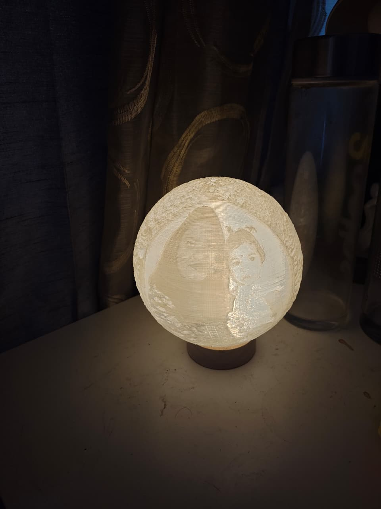

# PrintMyMemory

> **Crafted by us. Gifted by you.**

Turn your precious memories into beautiful, personalized 3D printed gifts. From photo to physical masterpiece — we handle the entire journey.



## Live Demo

[https://printmymemory.vercel.app](https://printmymemory.vercel.app) *(deploy yours below)*

---

## What We Build

| Product | Description | Starting Price |
|---------|-------------|----------------|
| **3D Face Miniatures** | Hand-painted 3D bust of your loved one | ₹2,499 |
| **Lithophane Lamps** | Photos that illuminate when lit | ₹1,999 |
| **Personalized Name Plates** | Elegant desk/door name plates | ₹999 |
| **Custom Keychains** | Carry memories everywhere | ₹499 |
| **Couple Gifts** | Heart-shaped lamps & couple busts | ₹3,499 |
| **Corporate Gifts** | Premium bulk 3D printed gifts | ₹4,999 |

---

## Tech Stack

| Layer | Technology |
|-------|-----------|
| **Frontend** | React 18 + Vite |
| **Styling** | Tailwind CSS 3 |
| **Animations** | Framer Motion |
| **Icons** | Lucide React |
| **Routing** | React Router v7 |
| **Auth & DB** | Supabase |
| **Payments** | Razorpay |
| **Hosting** | Vercel |

---

## Features

- **Authentication** — Email/password + Google OAuth via Supabase Auth
- **Shopping Cart** — Add/remove items, quantity controls, persists across sessions
- **Razorpay Checkout** — Secure payment flow with order tracking
- **Order History** — View all past orders with status tracking
- **User Profiles** — Editable profile with address, phone, etc.
- **Community** — Share your 3D printed creations with others
- **Responsive Design** — Mobile-first, works on all screen sizes
- **Dark Theme** — Premium dark UI with orange accents

---

## Quick Start

### Prerequisites

- Node.js 18+
- A Supabase project ([create one free](https://supabase.com))
- A Razorpay account ([create one](https://razorpay.com)) *(test mode works for demos)*

### 1. Clone & Install

```bash
git clone https://github.com/YOUR_USERNAME/printmymemory.git
cd printmymemory
npm install
```

### 2. Environment Variables

Create a `.env` file in the root:

```env
# Supabase (get from your project dashboard)
VITE_SUPABASE_URL=https://your-project.supabase.co
VITE_SUPABASE_ANON_KEY=your-anon-key

# Razorpay (test keys work for development)
VITE_RAZORPAY_KEY_ID=rzp_test_xxxxxxxxxxxx
```

### 3. Set Up Database

1. Go to your Supabase project → SQL Editor
2. Copy the contents of [`supabase_schema.sql`](supabase_schema.sql)
3. Run the SQL to create all tables, policies, and seed data

### 4. Enable Auth Providers (optional)

In Supabase Dashboard → Authentication → Providers:
- Enable **Google** OAuth (add your Google Client ID/Secret)
- Or use email/password which works out of the box

### 5. Run Locally

```bash
npm run dev
```

Open [http://localhost:5173](http://localhost:5173)

### 6. Build for Production

```bash
npm run build
```

---

## Deploy to Vercel

```bash
npm i -g vercel
vercel --prod
```

Make sure to add your environment variables in the Vercel dashboard:
- Project Settings → Environment Variables

---

## Project Structure

```
printmymemory/
├── public/
│   └── images/              # Product photos
├── src/
│   ├── components/          # Reusable UI components
│   │   ├── Navbar.jsx
│   │   ├── HeroSection.jsx
│   │   ├── Footer.jsx
│   │   └── ...
│   ├── contexts/            # React Context providers
│   │   ├── AuthContext.jsx  # Supabase auth
│   │   └── CartContext.jsx  # Shopping cart
│   ├── hooks/               # Custom hooks
│   ├── lib/                 # Utilities
│   │   ├── supabaseClient.js
│   │   └── razorpay.js
│   ├── pages/               # Route pages
│   │   ├── Home.jsx
│   │   ├── Shop.jsx
│   │   ├── Login.jsx
│   │   ├── Cart.jsx
│   │   ├── Orders.jsx
│   │   ├── Profile.jsx
│   │   ├── Community.jsx
│   │   └── ...
│   ├── App.jsx              # Routes
│   └── main.jsx             # Entry point
├── supabase_schema.sql      # Database setup
├── tailwind.config.js
└── vercel.json              # SPA routing
```

---

## Supabase Schema

The database includes:

| Table | Purpose |
|-------|---------|
| `profiles` | User profiles (auto-created on signup) |
| `products` | Product catalog |
| `cart_items` | User shopping carts |
| `orders` | Order records |
| `order_items` | Line items per order |
| `reviews` | Product reviews |
| `community_posts` | Community sharing |

All tables have **Row Level Security (RLS)** enabled so users can only access their own data.

---

## Payment Flow

1. User adds items to cart
2. Clicks "Proceed to Checkout"
3. Razorpay checkout modal opens
4. User completes payment
5. Order is saved to Supabase with payment ID
6. Cart is cleared
7. User sees order confirmation + order history

> **Note:** For production, create a Supabase Edge Function to verify Razorpay signatures server-side.

---

## Environment Variables Reference

| Variable | Required | Description |
|----------|----------|-------------|
| `VITE_SUPABASE_URL` | Yes | Your Supabase project URL |
| `VITE_SUPABASE_ANON_KEY` | Yes | Your Supabase anon/public key |
| `VITE_RAZORPAY_KEY_ID` | Yes | Razorpay test/live key ID |

---

## Screenshots

| Home | Shop | Cart |
|------|------|------|
| Hero with 3D products | Product grid with filters | Full checkout flow |

| Login | Profile | Community |
|-------|---------|-----------|
| Google + email auth | Editable user profile | Share creations |

---

## Contributing

1. Fork the repo
2. Create a feature branch: `git checkout -b feature/amazing-feature`
3. Commit: `git commit -m 'Add amazing feature'`
4. Push: `git push origin feature/amazing-feature`
5. Open a Pull Request

---

## License

MIT — feel free to use this for your own projects!

---

## Contact

- WhatsApp: [+91 98765 43210](https://wa.me/919876543210)
- Email: hello@printmymemory.in
- Location: Mumbai, Maharashtra, India

---

<p align="center">
  <sub>Made with love in India 🇮🇳</sub>
</p>
